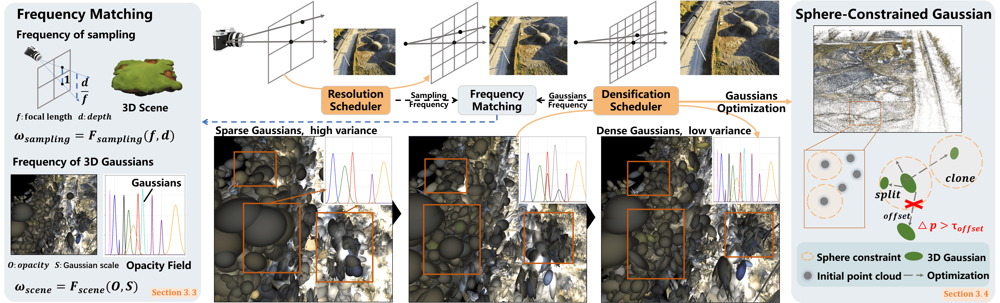
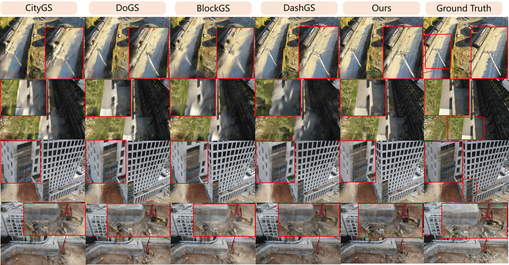

<div align="center">

# Signal Structure-Aware Gaussian Splatting for Large-Scale Scene Reconstruction

Weiyi Xue, Fan Lu, Chi Zhang, Tianhang Wang, Sanqing Qu, Zehan Zheng, Boyuan Zheng, Junqiao Zhao, Guang Chen

**ICLR 2026**

**[Paper](https://arxiv.org/pdf/2607.01698v1)**

</div>

<p align="center">
  
</p>

This repository contains the official PyTorch implementation of **Signal Structure-Aware Gaussian Splatting for Large-Scale Scene Reconstruction**.

Large-scale scenes often contain sparse or unevenly observed regions. Directly supervising low-frequency sparse COLMAP initialization with high-frequency images can cause uncontrolled densification and redundant Gaussian primitives. This project implements a frequency-aware training pipeline that synchronizes image supervision resolution with Gaussian frequency evolution, and adds geometry-aware regularization for more stable large-scale reconstruction.

The original implementation caches all training images at multiple resolutions, which requires substantial GPU memory and is therefore not suitable for common consumer GPUs such as the RTX 4090. To improve usability, we have refactored the code and optimized the strategy for determining frequency convergence. This version is slightly different from the implementation described in the paper, but it is more concise and no longer requires manually tuning parameters according to the scene scale. 
On Mill-19 Rubble, in this version, the corresponding scores are 27.31, 0.837, and 0.199, respectively. The total time for coarse and block training is approximately 1 hour and 15 minutes. We will continue to update and improve the code in future releases.


## News

- Code release for the ICLR 2026 submission.


## Method Overview

The training pipeline follows a coarse-to-fine large-scale Gaussian reconstruction workflow:

1. Train a coarse global Gaussian model. (This model will be trained at a lower image resolution, so it is less likely to run out of memory.)
2. Partition the scene into spatial blocks using the coarse model.
3. Train each block from low image resolution and increase resolution adaptively.
4. Merge block Gaussians into a fused model.
5. Render validation views and compute metrics.

The main implementation pieces are:

- **SIG dynamic-resolution scheduler**: monitors Gaussian scale-frequency convergence and increases image resolution when the current level becomes stable.
- **Staged densification**: couples densification with resolution changes so Gaussians are not over-optimized against high-frequency supervision too early.
- **Sphere-Constrained Gaussians and Anchor-based adaptive control.**: Optimize Gaussians from the original geometric structure.

<p align="center">
  
</p>

## Installation

The code was tested in a Python 3.10 environment with PyTorch 2.6 and CUDA 12.6.

```bash
git clone https://github.com/weiyixue999/Signal_Structure_Aware_Gaussian.git
cd Signal_Structure_Aware_Gaussian

conda create -n siggs python=3.10
conda activate siggs
```

Install PyTorch according to your CUDA version. For CUDA 12.6, the environment used for development contains:

```bash
pip install torch==2.6.0 torchvision==0.21.0 torchaudio==2.6.0 --index-url https://download.pytorch.org/whl/cu126
```

Install the Python dependencies:

```bash
pip install -r requirements.txt
```

Install the CUDA extensions required by 3D Gaussian Splatting.
This implementation uses the official 3DGS training-speed acceleration path, so `diff-gaussian-rasterization` must expose `SparseGaussianAdam` and return inverse depth from the rasterizer.

```bash
git clone --recursive https://github.com/graphdeco-inria/gaussian-splatting.git /tmp/gaussian-splatting
cd /tmp/gaussian-splatting/submodules/diff-gaussian-rasterization
# pip uninstall diff-gaussian-rasterization -y
# rm -rf build
git checkout 3dgs_accel
pip install . --no-build-isolation

cd /tmp/gaussian-splatting/submodules/simple-knn
pip install . --no-build-isolation
```

Make sure the imports work before training:

```bash
python - <<'PY'
from diff_gaussian_rasterization import GaussianRasterizer, SparseGaussianAdam
from simple_knn._C import distCUDA2
print("CUDA extensions are ready.")
PY
```

## Dataset Layout

The code expects COLMAP-style data:

```text
data/<scene>/
  train/
    images/
    sparse/0/
    depth_any/                 # optional, generated by DepthAnythingV2
  val/
    images/
    sparse/0/
```

For the provided Rubble configuration:

```text
data/rubble/train
data/rubble/val
```

The Rubble configs are:

```text
config/rubble_coarse.yaml
config/rubble_c9_r4.yaml
```

## Optional DepthAnythingV2 Supervision

Depth regularization is enabled automatically when the train split contains:

```text
data/<scene>/train/depth_any/<image_name>.png
data/<scene>/train/sparse/0/depth_params.json
```

Generate the depth maps offline:

```bash
python tools/generate_depthanything_v2.py \
  --scene-path data/rubble/train \
  --depth-anything-root third_party/Depth-Anything-V2 \
  --checkpoint checkpoints/depth_anything_v2_vits.pth \
  --encoder vits
```

The script writes normalized monocular depth maps to `depth_any/`, then fits per-image inverse-depth alignment parameters using COLMAP sparse points:

```text
inverse_depth = scale * depth_any + offset
```

Depth loss weights are controlled in `optim_params`:

```yaml
depth_l1_weight_init: 1.0
depth_l1_weight_final: 0.1
reproject_l1_weight_init: 0.1
reproject_l1_weight_final: 0.01
```

## Running

The recommended entry point is:

```bash
bash run.sh
```

The script runs coarse training, scene partitioning, block training, block merging, rendering, and metric evaluation.

All generated outputs are rooted at `OUTPUT_ROOT`. The default in `run.sh` is `output_new`:

```bash
OUTPUT_ROOT=output_new bash run.sh
```

To move an experiment to another folder, either edit `OUTPUT_ROOT` once in `run.sh`, or override it at launch:

```bash
OUTPUT_ROOT=output_exp01 bash run.sh
```

## Important Configuration

### Coarse Training

Useful fields in `config/rubble_coarse.yaml`:

```yaml
iterations: 20000
resolution: 4
coarse_resolution_mode: "dynamic"
optimizer_type: "sparse_adam"
chunk_cache_size: 1700
chunk_cache_iterations: 60000
init_point_max_points: 0
init_point_extent_multiplier: 0.0
```

`coarse_resolution_mode` controls coarse image resolution:

```text
"dynamic"  start low and use the scheduler
"min"      keep coarse training at resolution_start_level
integer    lock coarse training to a specific level
```

`init_point_max_points: 0` keeps all original COLMAP points. Setting it to a positive value randomly downsamples the initial point cloud.

`optimizer_type: "sparse_adam"` uses `SparseGaussianAdam` from the accelerated rasterizer. Set it to `"default"` to use regular `torch.optim.Adam`.

During coarse training, the scheduler writes `coarse_ratio.json` in the coarse output folder. It stores the final coarse resolution level and `coarse_ref_slope`, which can be reused by block training.

### Fine / Block Training

Useful fields in `config/rubble_c9_r4.yaml`:

```yaml
pretrain_path: "output_new/rubble_coarse/point_cloud"
model_path: "output_new/rubble_c9_r4"
block_resolution_start: "coarse"
use_coarse_slope_ref: True
```

`pretrain_path` should point to the parent `point_cloud` directory. The code automatically resolves the latest available iteration, such as:

```text
output_new/rubble_coarse/point_cloud/iteration_30000/point_cloud.ply
```

`use_coarse_slope_ref` controls how the scheduler normalizes slope in block training:

```text
True   use coarse_ref_slope saved by coarse training
False  estimate slope_ref online within the current block/level
```

## Dynamic Resolution Scheduler

The scheduler is configured in `optim_params`:

```yaml
dynamic_resolution: True
resolution_start_level: 1
resolution_end_level: 5
block_resolution_start: "coarse"
resolution_update_interval: 100
resolution_metric_window: 5
resolution_slope_ratio_threshold: 0.05
resolution_curvature_ratio_threshold: 0.1
resolution_stable_windows: 3
use_coarse_slope_ref: True
densify_stage_start: 500
densify_stage_end: 3000
extend_densify_on_resolution_change: True
```

With `resolution: 4` and `resolution_end_level: 5`, the effective image scale is:

```text
level 1: 0.25 * 1 / 5 = 0.05
level 2: 0.25 * 2 / 5 = 0.10
level 3: 0.25 * 3 / 5 = 0.15
level 4: 0.25 * 4 / 5 = 0.20
level 5: 0.25 * 5 / 5 = 0.25
```

Every `resolution_update_interval` iterations, the scheduler samples a frequency metric and fits a quadratic curve over the latest `resolution_metric_window` samples. A window is considered stable when the normalized slope and curvature satisfy the configured thresholds. After `resolution_stable_windows` stable windows, training switches to the next higher resolution level.

## Image Loading and Chunk Cache

Large image collections should not be fully preloaded at all resolutions. This implementation supports chunked CPU caching:

```yaml
chunk_cache_size: 500
chunk_cache_iterations: 2500
```

The current Rubble fine-training config uses `chunk_cache_size: 1000` and `chunk_cache_iterations: 6000`; reduce these values on machines with less CPU memory.

Image resizing during cache construction can optionally run on GPU:

```yaml
gpu_resize_cache: True
gpu_resize_mode: "bicubic"
gpu_cache_after_resize: True
```

When `gpu_resize_cache` is enabled, source images are decoded on CPU and resized on GPU with `torch.nn.functional.interpolate`. If `gpu_cache_after_resize` is also enabled, the resized tensors remain in the GPU chunk cache instead of being moved back to CPU. This avoids per-iteration image copies, but the chunk cache will consume GPU memory; use a smaller `chunk_cache_size` if VRAM becomes tight.

The loader behavior is:

1. Load and resize 500 images at the current resolution level.
2. Train for 2500 iterations by sampling from this chunk.
3. Release the chunk and cache the next 500 images.
4. If the resolution level changes, rebuild the chunk at the new resolution.

This reduces memory pressure on ordinary machines. For maximum throughput, precomputing an image pyramid offline is still recommended.

## Rendering and Evaluation

Evaluation rendering uses the base training scale `1 / resolution` and disables the initial dynamic low-resolution level. For Rubble:

```text
original val image: 4608x3456
resolution: 4
render/eval image: 1152x864
```

Outputs are written under:

```text
output_new/rubble_c9_r4/val/ours_<iteration>/renders
output_new/rubble_c9_r4/val/ours_<iteration>/gt
output_new/rubble_c9_r4/results.json
```

## Logs

Each training run writes scheduler logs:

```text
resolution_schedule.csv
resolution_schedule.json
resolution_metrics.csv
```

For coarse training:

```text
output_new/rubble_coarse/resolution_schedule.csv
```

For block training:

```text
output_new/rubble_c9_r4/cells/cell0/resolution_schedule.csv
output_new/rubble_c9_r4/cells/cell1/resolution_schedule.csv
...
```

`resolution_schedule.csv` records resolution level changes. `resolution_metrics.csv` records each metric sample, including slope and curvature statistics.

## Common Issues

### Block training stays at low resolution

Inspect:

```text
output_new/<scene>/cells/cell*/resolution_metrics.csv
```

Then relax the scheduler thresholds:

```yaml
resolution_slope_ratio_threshold: 0.2
resolution_stable_windows: 1
```

### Out of Memory
During densification, too many Gaussians may be generated, which can lead to OOM errors. To address this issue, simply increase the gradient threshold for densification. For example, in `rubble_c9_r4.yaml`, change `densify_grad_threshold` from `0.00012` to `0.00015`.

### Training speed

The bottleneck is often image decode/resize rather than CPU-to-GPU copy. For larger speedups, precompute a resized image pyramid and train directly from resized images.

## Citation

If this repository is helpful for your research, please cite our paper:

```bibtex
@inproceedings{xue2026signal,
  title     = {Signal Structure-Aware Gaussian Splatting for Large-Scale Scene Reconstruction},
  author    = {Xue, Weiyi and Lu, Fan and Zhang, Chi and Wang, Tianhang and Qu, Sanqing and Zheng, Zehan and Zheng, Boyuan and Zhao, Junqiao and Chen, Guang},
  booktitle = {International Conference on Learning Representations},
  year      = {2026}
}
```

## Acknowledgements

This codebase builds on the 3D Gaussian Splatting ecosystem and large-scale Gaussian reconstruction pipelines such as CityGaussian. We thank the authors of the related open-source projects.

## License

Please see [LICENSE](LICENSE). Before redistribution, check the licenses of inherited 3DGS components and third-party CUDA extensions.
